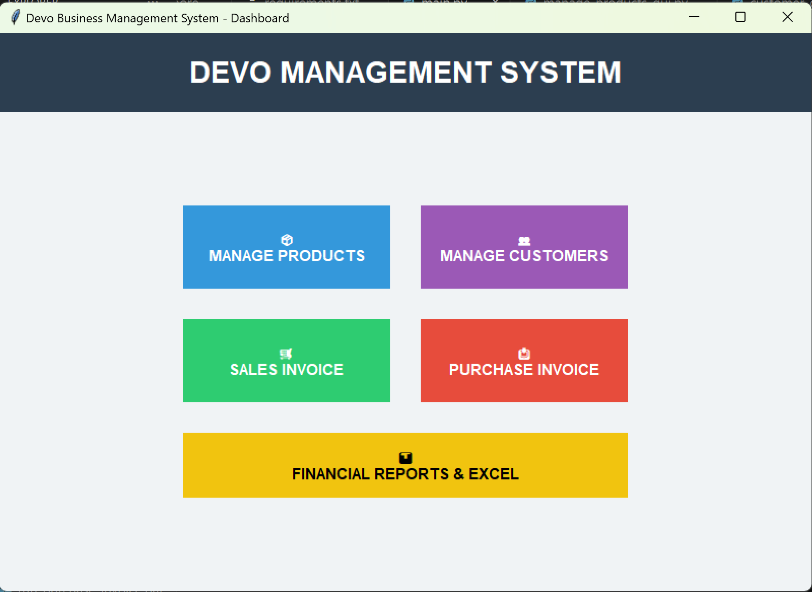
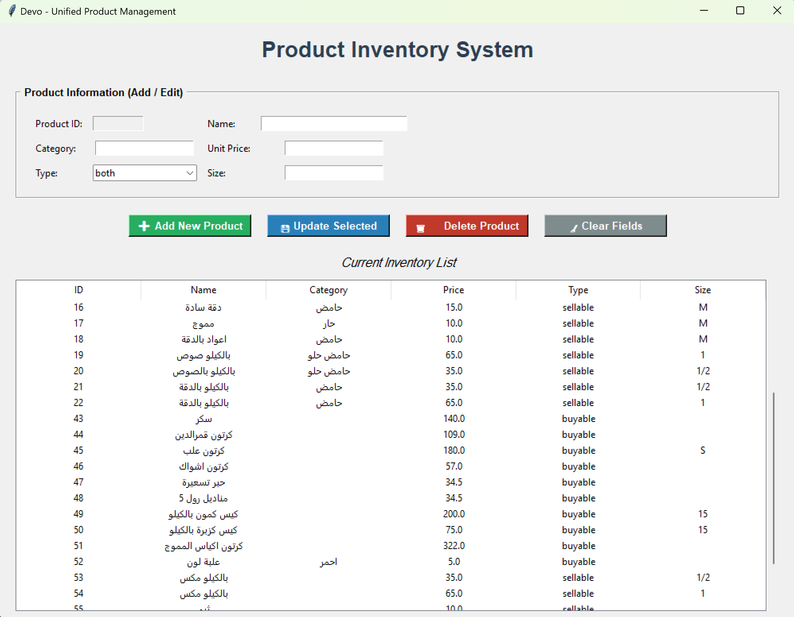
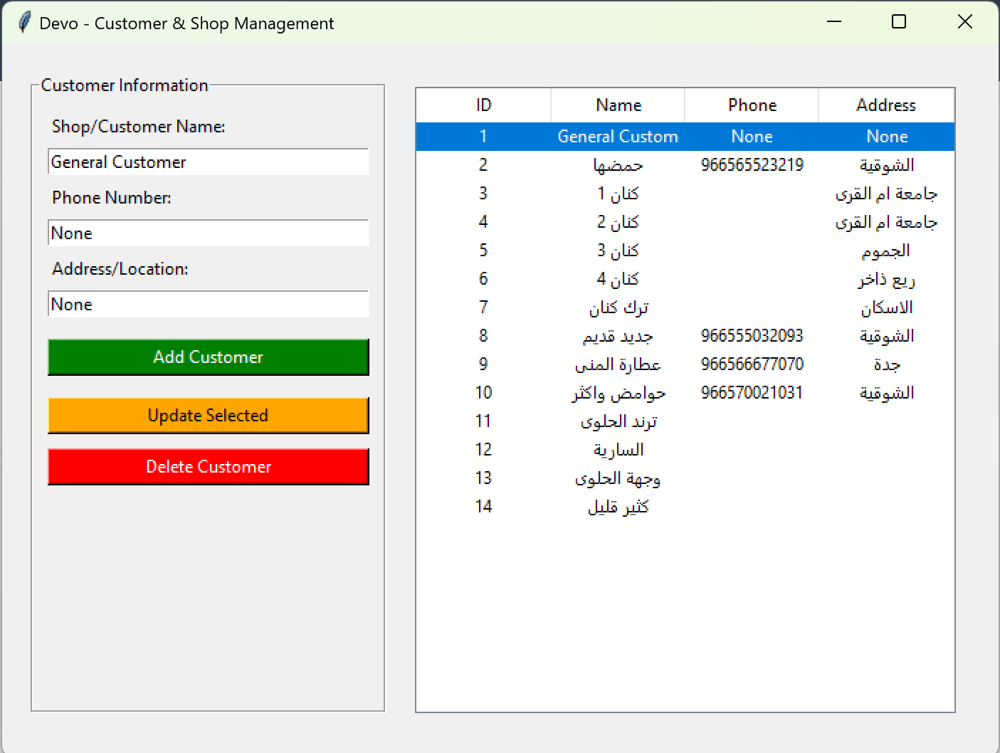
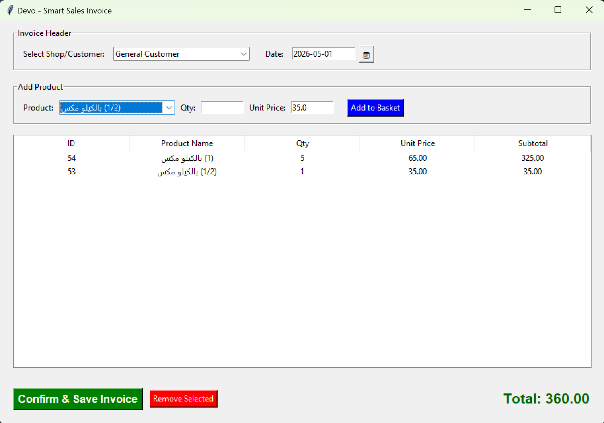
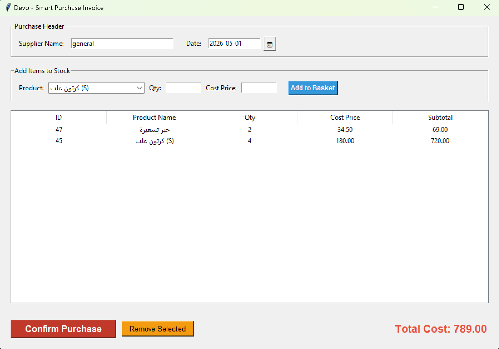
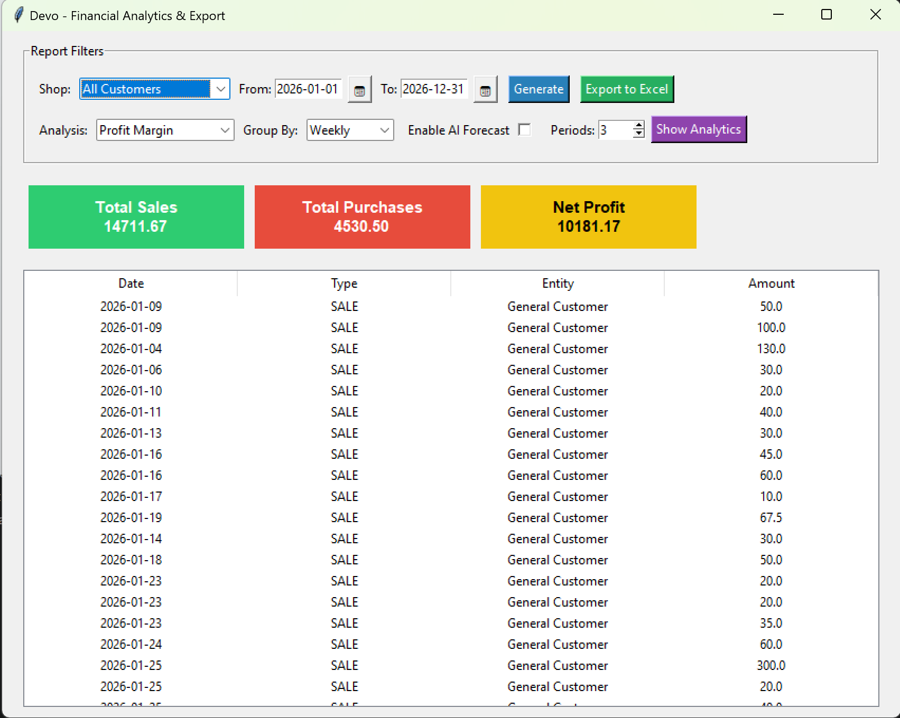
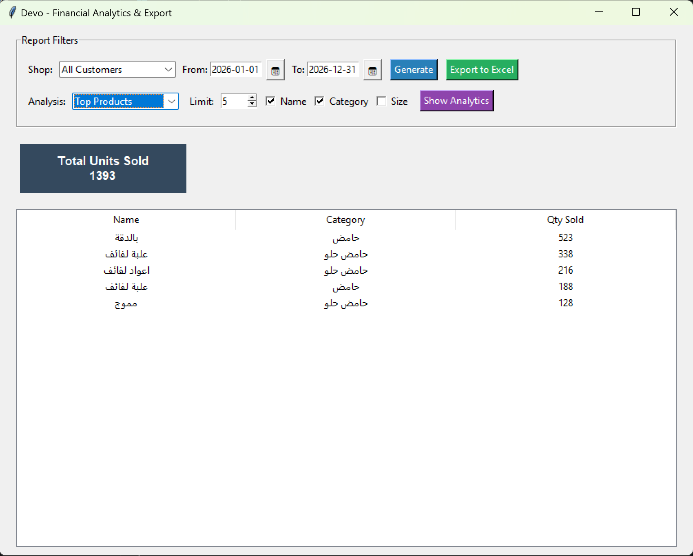
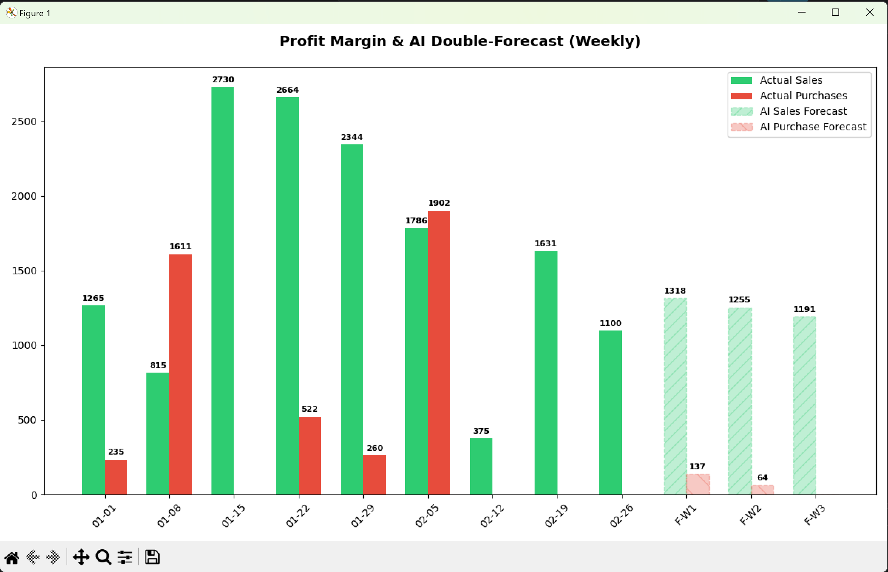
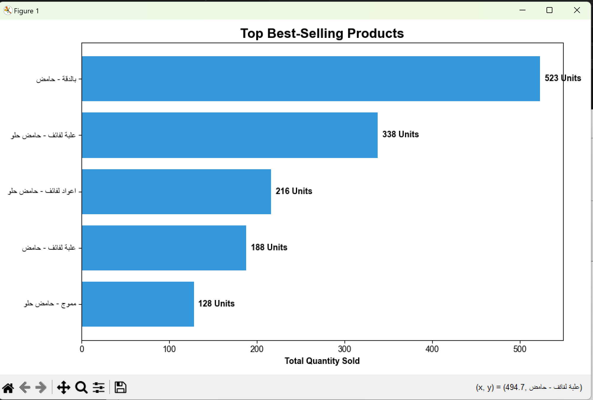

# 📦 Devo - Unified Business Management System

<p align="center">
  
</p>

Devo is a comprehensive, AI-enhanced Desktop Application designed for inventory management, sales tracking, predictive analytics, and purchase invoicing. Built with Python and Tkinter, it focuses on providing a professional, modular approach to accounting data management with a seamless user experience and advanced data visualization.

## ✨ Features

*   **📦 Product Management:** Full CRUD operations (Add, Edit, Delete) with categorization for Sellable and Buyable items.
*   **👥 Customer & Shop Database:** Integrated registry for managing customers and shops efficiently.
*   **🛒 Invoicing System:** Dynamic sales and purchase invoicing module linked directly to the database for real-time updates.
*   **🧠 AI-Driven Forecasting:** Integrated Machine Learning (via scikit-learn & NumPy) to predict future sales and profit margins based on historical data.
*   **📈 Advanced Visualizations:** Interactive charts and graphs for "Top Products" and "Profit Margins" powered by Matplotlib.
*   **📊 Financial Reports:** Generate accurate financial summaries, analyze trends, and export them to Excel for advanced accounting reviews.
*   **🗄️ Robust Data Handling:** Powered by SQLite to ensure fast, reliable, and secure local data storage, with a modular analytics architecture for high performance.

## 🛠️ Tech Stack

*   **Language:** Python 3.x
*   **GUI Framework:** Tkinter (Custom Styled)
*   **Database:** SQLite3
*   **Machine Learning & Math:** scikit-learn, NumPy
*   **Data Analysis & Visualization:** Pandas, Matplotlib
*   **Version Control:** Git & GitHub

## 🎨 System Screenshots

### 🖥️ Core Management
| Product Inventory System | Customer & Shop Management |
| :---: | :---: |
|  |  |

### 🛒 Smart Invoicing
| Smart Sales Invoice | Smart Purchase Invoice |
| :---: | :---: |
|  |  |

### 📊 Financial Analytics & Reports
| Comprehensive Analytics | Top Products Report |
| :---: | :---: |
|  |  |

### 📈 AI Forecasting & Data Visualization
| Profit Margin & AI Forecast | Top Best-Selling Products |
| :---: | :---: |
|  |  |

## 🚀 Installation & Setup

1. Clone the repository:
   ```bash
   git clone [https://github.com/anas-roshdi/devo.git](https://github.com/anas-roshdi/devo.git)
2. Install dependencies:
   ```bash
   pip install -r requirements.txt
4.  Run the application:
    ```bash
    python main.py
   Or use the provided batch file: ./run_devo.bat
