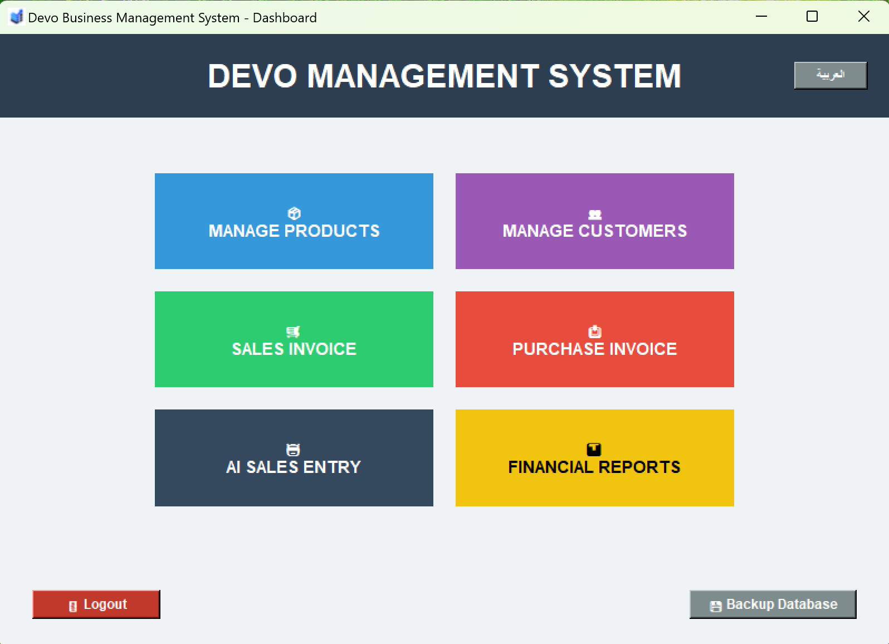
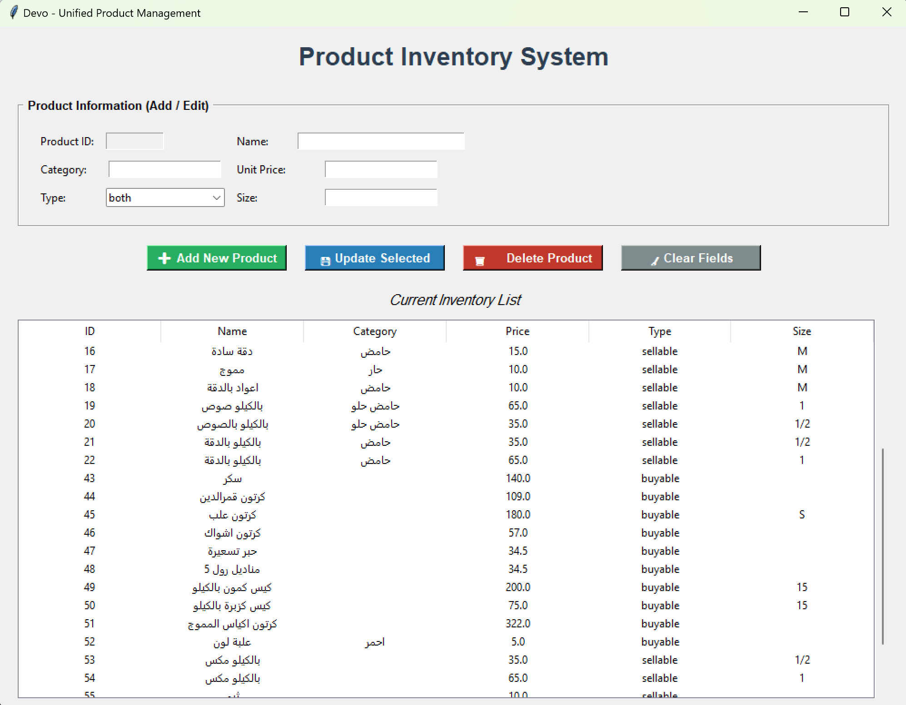
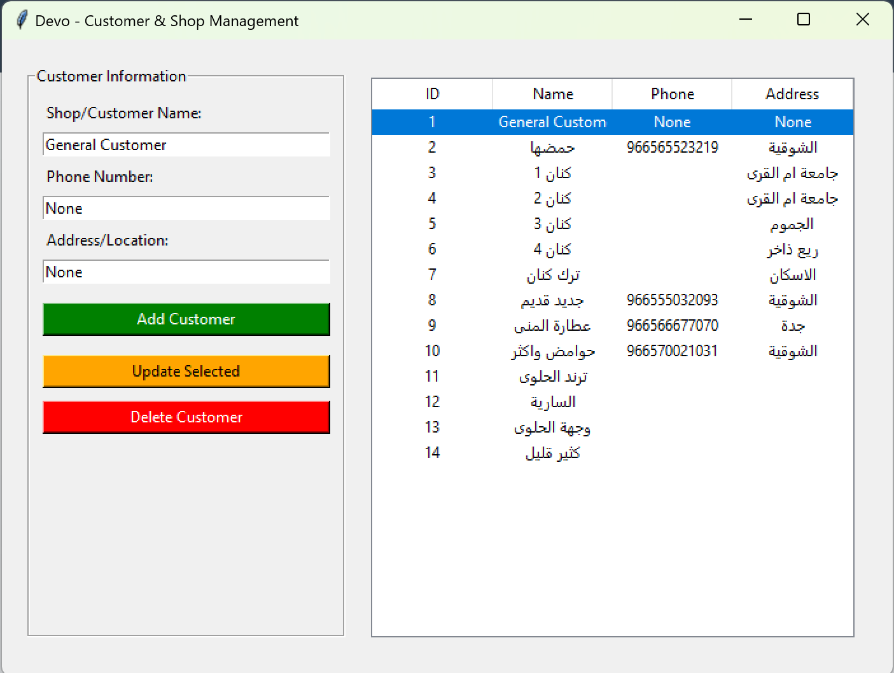
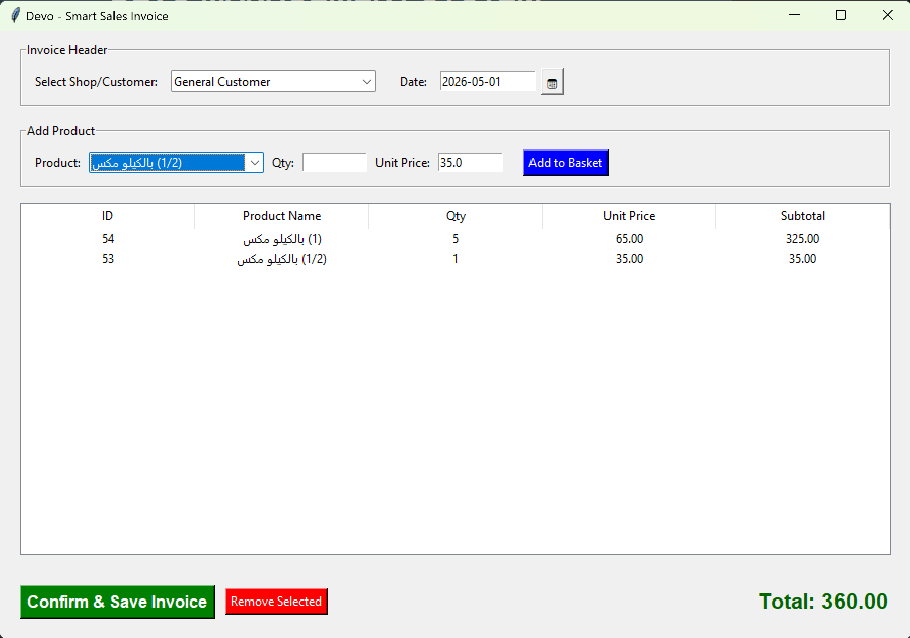
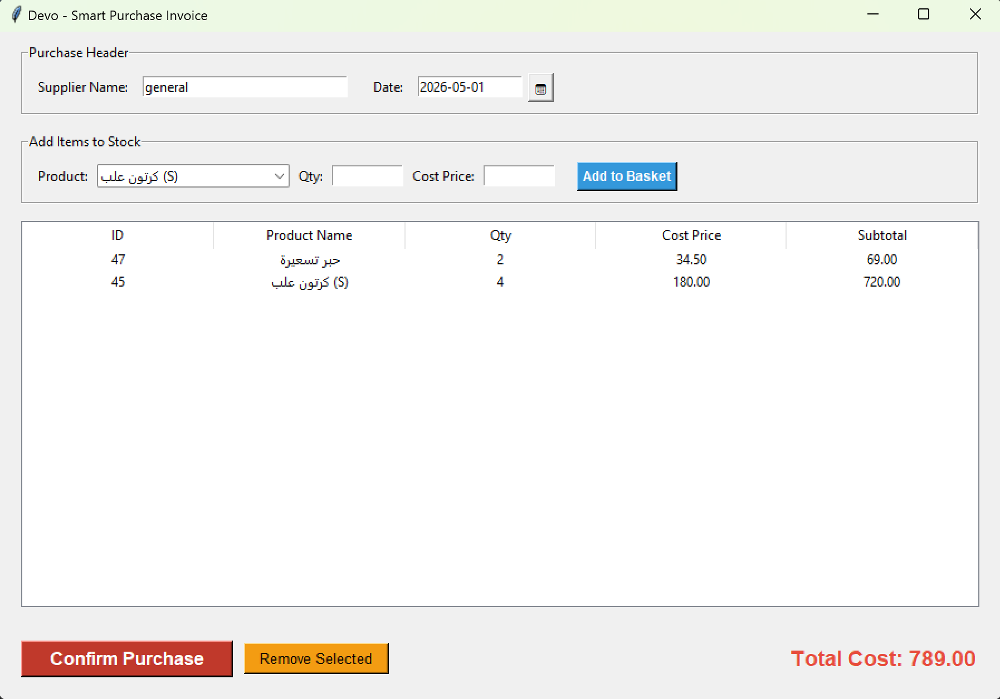
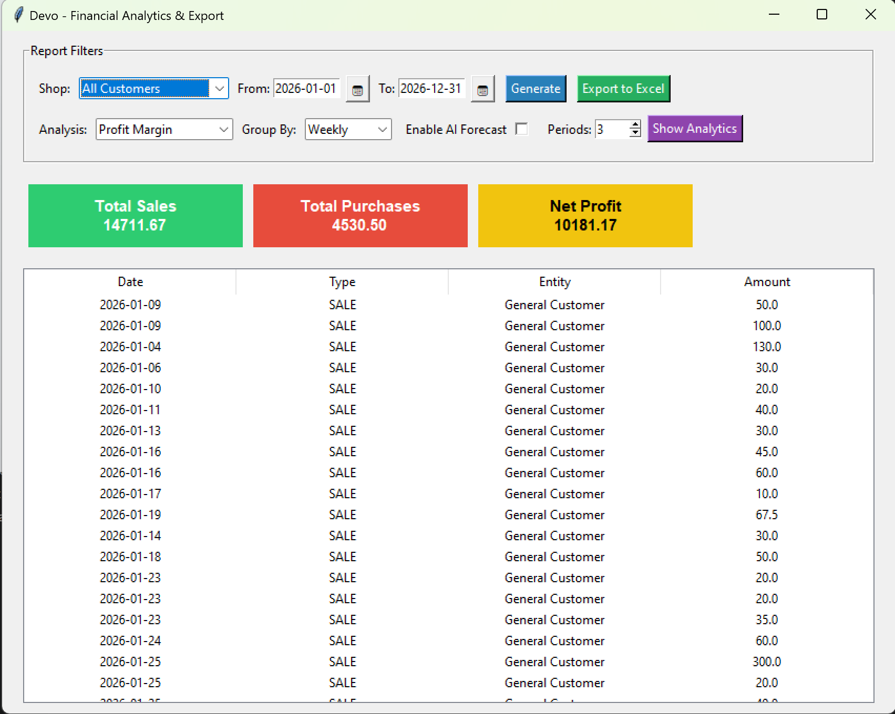
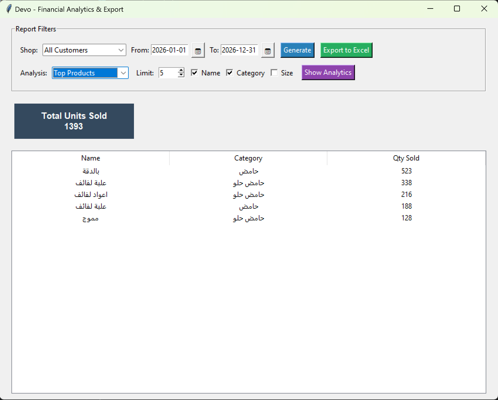

# 📦 Devo - AI-Powered Business Management System

<p align="center">
  
</p>

Devo is a production-ready, AI-enhanced desktop business management and accounting application. Built with Python and Tkinter, it streamlines accounting workflows for businesses by combining traditional inventory and invoicing management with an adaptive Natural Language Processing (NLP) engine for automated WhatsApp order processing, dynamic financial analytics, and bilingual localization.

## ✨ Key Features

*   **🤖 AI WhatsApp Invoice Extractor:** Parses unstructured WhatsApp messages and extracts line items into structured sales invoices using fuzzy matching and a continuous learning engine that adapts to user corrections.
*   **🌐 Full Bilingual Localization:** Seamless dynamic language switching between Arabic and English, featuring complete Right-to-Left (RTL) layout support and localized report rendering.
*   **📦 Product & Inventory Management:** Complete CRUD operations with categorization for sellable goods and raw materials.
*   **👥 Customer & Vendor Directory:** Centralized registry for managing customer and vendor records alongside customized transaction pricing history.
*   **🛒 Invoicing & Point of Sale:** Dynamic sales and purchase invoice builder linked directly to SQLite for transactional integrity.
*   **📈 Advanced Visualizations & Analytics:** Real-time dashboards for top products, sales trends, and profit margins powered by Matplotlib, Pandas, and Arabic text reshaping.
*   **🧠 AI-Driven Forecasting:** Machine learning models (scikit-learn & NumPy) to predict sales and margin trends based on historical transaction logs.
*   **🚀 Zero-Configuration Deployment:** Packaged into a standalone Windows executable (`.exe`) distributed via an Inno Setup installer.

## 🛠️ Tech Stack

*   **Language:** Python 3.x
*   **GUI Framework:** Tkinter (Custom Themed)
*   **Database:** SQLite3
*   **Data Science & Analytics:** Pandas, NumPy, scikit-learn, Matplotlib
*   **Text Processing & NLP:** difflib, python-bidi, arabic-reshaper
*   **Packaging & Distribution:** PyInstaller, Inno Setup

## 🎨 System Screenshots

### 🖥️ Core Management
| Product Inventory System | Customer & Shop Management |
| :---: | :---: |
|  |  |

### 🛒 Invoicing
| Sales Invoice | Purchase Invoice |
| :---: | :---: |
|  |  |

### 📊 Financial Analytics & Reports
| Comprehensive Analytics | Top Products Report |
| :---: | :---: |
|  |  |

### 📈 AI Forecasting & Data Visualization
| Profit Margin & AI Forecast | Top Best-Selling Products |
| :---: | :---: |
|  |  |

## 📦 Download & Installation (End-Users)

Pre-built Windows binaries are available without requiring a Python environment:

1. Download the latest installer (`Devo_Setup_v1.0.0.exe`) from the [Releases](https://github.com/anas-roshdi/devo/releases) section.
2. Run the setup wizard and follow the on-screen instructions.
3. Launch **Devo** directly from the Desktop or Start Menu shortcut.

## 💻 Developer Setup & Local Build

To run or build the project from source:

1. **Clone the repository:**
   ```bash
   git clone [https://github.com/anas-roshdi/devo.git](https://github.com/anas-roshdi/devo.git)
   cd devo

2. **Set up a virtual environment and install dependencies:**
  python -m venv .venv
  source .venv/bin/activate  # On Windows: .venv\Scripts\activate
  pip install -r requirements.txt

3. **Run the application:**
   python main.py

4. **Build the standalone executable:**
   pyinstaller --noconfirm --onedir --windowed --icon="assets/devo.ico" --add-data "assets;assets" --add-data "locales;locales" --hidden-import "tkcalendar" --hidden-import "babel.numbers" --hidden-import "matplotlib" --hidden-import "pandas" --hidden-import "arabic_reshaper" --hidden-import "bidi.algorithm" --name "Devo" main.py
